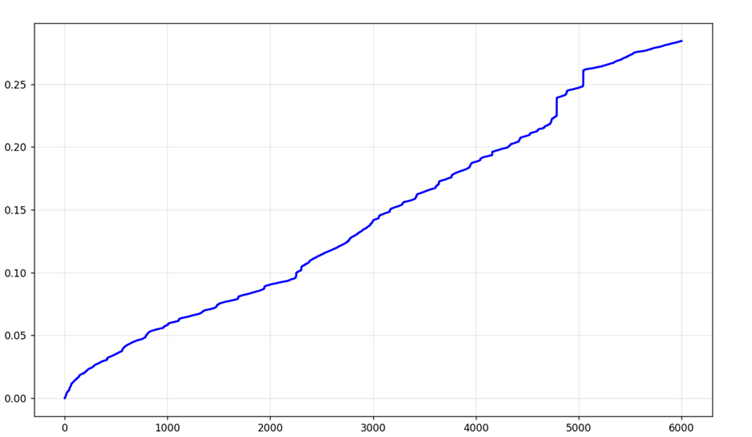
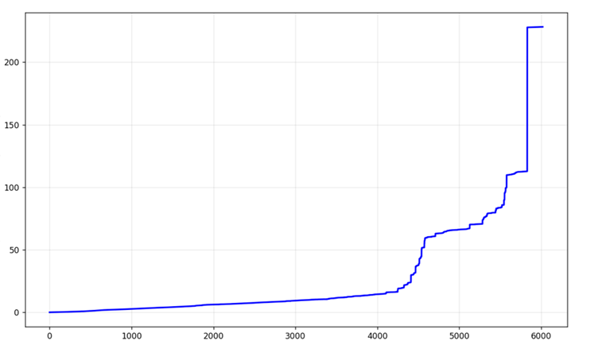

# forkbomb-os-analysis

Comparative study of fork bomb behavior across Linux and Windows — measuring process creation rates, CPU saturation, and OS resilience under extreme load.
## Overview

A fork bomb is a denial-of-service attack that exploits the process creation subsystem by recursively spawning child processes until system resources are exhausted. This project implements fork bombs for both Linux and Windows, measures their behavior with high-resolution timestamps, and visualizes the results.

The core research question: **how do fundamentally different process creation models (copy-on-write `fork()` vs. full image load `CreateProcessA()`) affect the speed and nature of system collapse?**

## Key Findings

| Metric | Linux (`fork()`) | Windows (`CreateProcessA()`) |
|---|---|---|
| Process creation speed | ~6000 processes in ~0.3s | ~6000 processes in ~200s |
| System behavior | Gradual slowdown, recoverable | Rapid crash, unrecoverable |
| Protection mechanisms | `cgroups`, `ulimit`, scheduler | Handle limits, no graceful degradation |
| Architecture | Copy-on-write (CoW) | Full executable image load from disk |

## Results

**Linux** — process count vs. time grows nearly linearly, then spikes sharply as the scheduler loses control:



**Windows** — system crashes before Task Manager can even display 100% CPU load. 



## Project Structure

```
forkbomb-os-analysis/
├── linux/
│   └── forkbomb.c          # fork() implementation with nanosecond logging
├── windows/
│   └── forkbomb.c          # CreateProcessA() implementation with FILETIME logging
├── analysis/
│   └── plot_processes.py   # Parses logs and generates process growth graphs
├── requirements.txt
└── .gitignore
```

## Getting Started

### Prerequisites

- Linux: GCC, any modern kernel
- Windows: MinGW or MSVC
- Python 3.8+ for analysis

```bash
pip install -r requirements.txt
```

### Running (Linux)

> ⚠️ **WARNING**: This will temporarily freeze or crash your system. Run only in a VM with a snapshot. Do NOT run on a production machine.

```bash
# Compile
gcc linux/forkbomb.c -o forkbomb

# Run inside a resource-limited cgroup for safety
systemd-run --scope -p TasksMax=512 ./forkbomb
```

### Running (Windows)

> ⚠️ **WARNING**: Same as above. Use a VM.

```bash
# Compile with MinGW
gcc windows/forkbomb.c -o forkbomb.exe -lkernel32

# Run
./forkbomb.exe
```

### Generating Graphs

```bash
python analysis/plot_processes.py --log fork_bomb.log --output analysis/graphs/
```

## How It Works

**Linux implementation** uses `fork()`, which creates a child process via copy-on-write — the kernel does not copy memory pages until one of the processes writes to them. This makes process creation extremely cheap (~microseconds), which is why the bomb grows so fast.

**Windows implementation** uses `CreateProcessA()`, which loads the executable image from disk into a new address space on every call. Each process creation involves disk I/O and full memory allocation, making it orders of magnitude slower — but the crash is harder to recover from.

## Safety Notes

- Always test in a **virtual machine with a snapshot**
- On Linux, set `ulimit -u 512` before running to limit damage
- On Windows, save all work and take a VM snapshot — recovery requires a reboot

## Tech Stack

- C (Linux syscalls, Windows API)
- Python 3, NumPy, Matplotlib

## License

MIT
